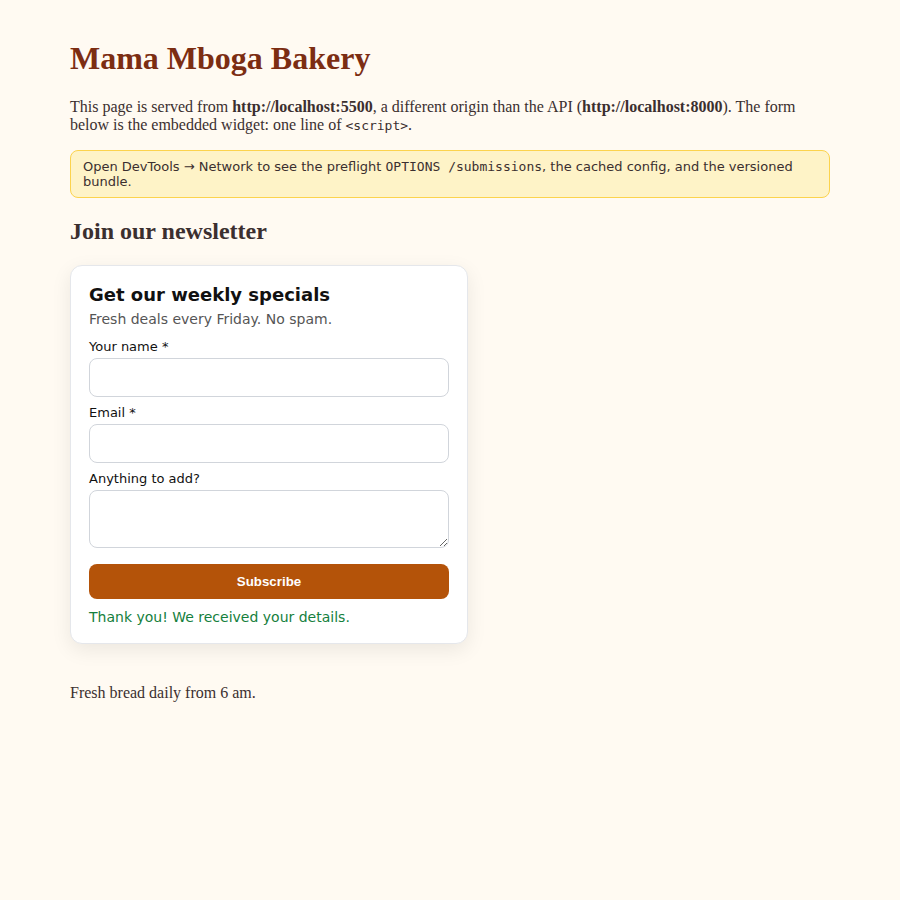

# Embeddable Widget & Lead-Capture Platform

FlyRank Internship · Backend Track · Capstone (`flyrank-capstone-widget-platform`)

Customers create signup or contact widgets and paste **one line of `<script>`** into any website. Visitors' submissions come back to a hardened public API, which:
- validates each submission against the widget's own field spec;
- applies CORS, including preflight;
- rate-limits per IP and per widget;
- blocks spam with a honeypot and a time trap;
- adds location data through a fallback chain (provider A → B → none);
- stores the submission, then sends a notification that may fail harmlessly.

Owners see everything in a tenant-isolated dashboard API.



**Stack:** Python 3.12 · FastAPI · SQLAlchemy · PostgreSQL (Docker) · vanilla JS widget (Shadow DOM) · Mailpit · pytest (18 tests).

## Architecture

```
 OWNER (Bearer token)                 CUSTOMER SITE (any origin, e.g. :5500)            VISITOR
 ──────────────────────               ──────────────────────────────────────            ───────
 POST/GET/PATCH/DELETE /api/widgets   <script src=":8000/widget.js?id=wgt_…">
   └─ tenant-isolated (404 for        GET /widget.js            Cache-Control: max-age=300 (loader)
      other tenants' widgets)         GET /assets/widget-<sha>.js  max-age=31536000, immutable
   └─ returns embed_snippet           GET /widgets/{id}/config  max-age=60 + ETag/304, CORS *
                                        └─ renders form in Shadow DOM ──────────► user fills form
                                                                                      │
                                      OPTIONS /submissions ◄── browser preflight ─────┤ 204 + CORS
                                      POST /submissions ◄─────────────────────────────┘
                                        1 size ≤10 KB (413) · JSON (400) · content type (415)
                                        2 widget exists (404) · origin allowed (403)
                                        3 rate limit per IP & per widget ──── 429 + Retry-After
                                        4 honeypot / time trap / links ────── 202 (silently dropped)
                                        5 validate vs widget field spec ───── 422 + per-field errors
                                        6 geo: mock_a / ip-api → mock_b / ipapi.co → none (still stored)
                                        7 COMMIT submission ─────────────────── 201
                                        8 notification job (background, 3 retries, alert) — failure can't undo 7
 GET /api/submissions · GET /api/stats (per day, per widget, spam blocked, by country) · /dashboard page
```

The design doc is in `docs/DESIGN.md`. Layers: HTTP `app/main.py` → logic `services.py`, `validation.py`, `ratelimit.py`, `geo.py`, `notify.py`, `assets.py` → data `db.py`.

## Run

```bash
cp .env.example .env
docker compose up --build -d                  # api :8000 · customer site :5500 · Postgres · Mailpit :8025
docker compose exec api python -m scripts.seed
docker compose exec api python -m pytest -q   # 18 passed
```

1. Open **http://localhost:5500**, the customer site on a different origin. The widget renders; submit it.
2. Open **http://localhost:8000/dashboard** and paste `wpt_demo_bakery_owner_token` to see the submission.

**Without Docker:**

```bash
pip install -r requirements.txt && python -m scripts.seed
uvicorn app.main:app --port 8000
cd demo-site && python -m http.server 5500
```

Demo tokens (seeded, sandbox-only):

| Tenant | Token |
|---|---|
| Mama Mboga Bakery | `wpt_demo_bakery_owner_token` |
| Other Company (for the isolation test) | `wpt_demo_other_company_token` |

## API

| Path | Auth | Purpose |
|---|---|---|
| `POST /api/tenants` | none | Sign up; returns an API token, shown once |
| `POST /api/widgets` | Bearer | Create a widget → 201, including `embed_snippet` |
| `GET /api/widgets` · `GET/PATCH/DELETE /api/widgets/{id}` | Bearer | CRUD. Another tenant's widget returns 404. PATCH bumps `config_version`. |
| `GET /api/widgets/{id}/embed` | Bearer | The one-line snippet |
| `GET /widget.js?id=` | public | Loader (`max-age=300`) |
| `GET /assets/widget-{hash}.js` | public | Versioned bundle (`immutable`, 1 year). An old hash gets a 301 to the current one. |
| `GET /widgets/{id}/config` | public, CORS `*` | Small public config (`max-age=60`, ETag → 304) |
| `OPTIONS /submissions` | public | Preflight → 204 with CORS headers |
| `POST /submissions` | public, CORS | `{widget_id, fields: {...}, _hp, _t}` → 201 / 202 (spam) / 400 / 403 / 404 / 413 / 415 / 422 / 429 |
| `GET /api/submissions?widget_id=&limit=` | Bearer | The tenant's submissions, with geo data |
| `GET /api/stats?days=30` | Bearer | Per day, per widget (including spam blocked), by country, % enriched, notification status |
| `POST /dev/geo-providers` `["mock_a"]` | dev | Probe 4: toggle mock providers down |
| `POST /dev/side-effects?fail=true` | dev | Probe 5: force the email to fail |

Widget `fields` spec:

```json
{"name": "email", "label": "Email", "type": "text|email|textarea|tel", "required": true, "max_length": 120}
```

Set `allowed_origins` (for example `["https://mysite.com"]`) to restrict where a widget can submit from; an empty list allows any origin.

## Probes, quickly

```bash
V='{"widget_id":"wgt_demoSignup01","fields":{"name":"Amina","email":"amina@example.com"},"_hp":"","_t":4200}'
H=(-H 'Origin: http://localhost:5500' -H 'Content-Type: application/json')

# Probe 3: burst → 5×201 then 429s
for i in $(seq 8); do curl -s -o /dev/null -w "%{http_code} " -X POST localhost:8000/submissions "${H[@]}" -H 'X-Forwarded-For: 1.2.3.4' -d "$V"; done

# Probe 4: geo provider A down
curl -X POST localhost:8000/dev/geo-providers -H 'Content-Type: application/json' -d '["mock_a"]'

# Probe 5: force the email to fail
curl -X POST 'localhost:8000/dev/side-effects?fail=true'
```

Real transcripts for every probe are in `EVIDENCE.md`.

## Real geo providers

Set `GEO_CHAIN=ip-api,ipapi-co` to use ip-api.com (free, no key) then ipapi.co (free tier). Private and loopback IPs are skipped because providers can't locate them. The probes use the deterministic mocks, as the brief requires.

## Limitations

- **Rate limiting:** in-memory and per-process. With several API replicas, move it to Redis or Postgres. Behind a real proxy, set `TRUST_X_FORWARDED_FOR=1` only when that proxy overwrites the header.
- **Background worker:** an in-process thread pool. A crash can leave notifications `queued`; a production system would use a durable queue.
- **Privacy:** IP addresses are stored only as a salted hash. There is no GDPR export or delete endpoint yet (stretch goal).
- **Spam:** the time trap relies on client-reported render time. Good bots can fake it, so proof-of-work or a CAPTCHA would be the next layer.
- **Dev toggles:** `/dev/*` must be disabled in production with `DEV_MODE=0`.
